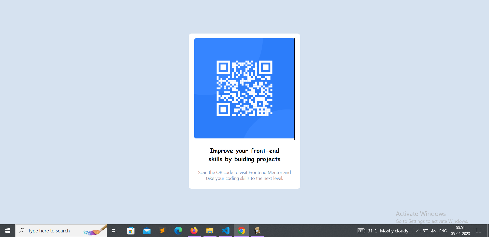

# Frontend Mentor - QR code component solution

This is a solution to the [QR code component challenge on Frontend Mentor](https://www.frontendmentor.io/challenges/qr-code-component-iux_sIO_H). 

### Screenshot

## My process

### Built with

- HTML
- CSS 

### What I learned

I didn't learn anything new while doing this project. But doing this project has boosted my confidence. It makes me feel that i am not useless developer and I can create stuffs And i will continue to do so.

### Continued development

I've completed this project but still sometimes i get confused while positioning elements. So i need to work on that. However there's always something new to learn.

## My social media accounts:
- Twitter - [@yourusername](https://twitter.com/hriteshdas99)

